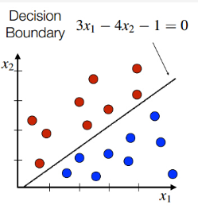

## Assignment 9.2 - Intoduction to Machine Learning
Regression algorithms are used to predict numeric quantity while classification algorithms predict categorical outcomes. A spam filter is an example use case for a classification algorithm. The input dataset is emails labeled as either spam (i.e. junk emails) or ham (i.e. good emails). The classification algorithm uses features extracted from the emails to learn which emails fall into which category.

In this problem, you will use the nearest neighbors algorithm to fit a model on two simplified datasets. The first dataset (found in [binary-classifier-data.csv](binary-classifier-data.csv) contains three variables; label, x, and y. The label variable is either 0 or 1 and is the output we want to predict using the x and y variables. The second dataset (found in [trinary-classifier-data.csv](trinary-classifier-data.csv) is similar to the first dataset except for the label variable can be 0, 1, or 2.

Note that in real-world datasets, your labels are usually not numbers, but text-based descriptions of the categories (e.g. spam or ham). In practice, you will encode categorical variables into numeric values.

a. Plot the data from each dataset using a scatter plot.

b. The k nearest neighbors algorithm categorizes an input value by looking at the labels for the k nearest points and assigning a category based on the most common label. In this problem, you will determine which points are nearest by calculating the Euclidean distance between two points. As a refresher, the Euclidean distance between two points: p1=(x1, y1) and p2=(x2,y2) is d=$\sqrt{(x_1 - X_2)^2 + (y_1 - Y_2)^2}$.

   Fitting a model is when you use the input data to create a predictive model. There are various metrics you can use to determine how well your model fits the data. You will learn more about these metrics in later lessons. For this problem, you will focus on a single metric; accuracy. Accuracy is simply the percentage of how often the model predicts the correct result. If the model always predicts the correct result, it is 100% accurate. If the model always predicts the incorrect result, it is 0% accurate.
 
   Fit a k nearest neighbors model for each dataset for k=3, k=5, k=10, k=15, k=20, and k=25. Compute the accuracy of the resulting models for each value of k. Plot the results in a graph where the x-axis is the different values of k and the y-axis is the accuracy of the model.

c. In later lessons, you will learn about linear classifiers. These algorithms work by defining a decision boundary that separates the different categories.



Looking back at the plots of the data, do you think a linear classifier would work well on these datasets?

 

```{r setup, include=FALSE}
knitr::opts_chunk$set(echo = TRUE)
```

```{r ,echo=FALSE,message=FALSE,warning=FALSE}
library(ggplot2)
library(stats)
library(GGally)
library(scatterplot3d)
library(lm.beta)
library("readxl")
library(foreign)
library(caTools)
```
### Import dataset

```{r import dataset,echo=FALSE,message=FALSE,warning=FALSE}
getwd()
setwd(".\\")
getwd()
binary_data <- read.csv("binary-classifier-data.csv")
trinary_data <- read.csv("trinary-classifier-data.csv")
binary_data <- binary_data[,c(2,3,1)]
trinary_data <- trinary_data[,c(2,3,1)]
head(binary_data)
```
```{r head trinary ,echo=FALSE,message=FALSE,warning=FALSE}
head(trinary_data)
```
### Scatter plots
#### Scatter plot of binary data
```{r scatter plot binary,echo=FALSE,message=FALSE,warning=FALSE}
ggplot(data = binary_data,aes(x=binary_data$x,y=binary_data$y)) +
  stat_smooth(method = "lm", col = "dodgerblue3") +
  geom_point()
```

#### Scatter plot of trinary data
```{r scatter plot trinary,echo=FALSE,message=FALSE,warning=FALSE}
ggplot(data = trinary_data,aes(x=trinary_data$x,y=trinary_data$y)) +
  stat_smooth(method = "lm", col = "dodgerblue3") +
  geom_point()
```
```{r 1,echo=FALSE,message=FALSE,warning=FALSE}
set.seed(20)
binary_clusters <- kmeans(binary_data[,1:2], 5)

# Save the cluster number in the dataset as column 'Borough'
binary_data$Clusters <- as.factor(binary_clusters$cluster)
head(binary_data)
```
```{r 2,echo=FALSE,message=FALSE,warning=FALSE}
trinary_clusters <- kmeans(trinary_data[,1:2], 5)

# Save the cluster number in the dataset as column 'Borough'
trinary_data$Clusters <- as.factor(trinary_clusters$cluster)
head(trinary_data)
```
```{r 3,echo=FALSE,message=FALSE,warning=FALSE}
ggplot(binary_data,aes(x=x,y=y,colour = as.factor(Clusters))) +
  stat_smooth(method = "lm", col = "dodgerblue3") +
  geom_point()
```
```{r 4,echo=FALSE,message=FALSE,warning=FALSE}
ggplot(trinary_data,aes(x=x,y=y,colour = as.factor(Clusters))) +
  stat_smooth(method = "lm", col = "dodgerblue3") +
  geom_point()
```
```{r scikit-learn,echo=FALSE,message=FALSE,warning=FALSE}
library(caTools)
set.seed(123)
split = sample.split(binary_data$label, SplitRatio = 0.75)
training_set = subset(binary_data, split == TRUE)
test_set = subset(binary_data, split == FALSE)

training_set <- training_set[,c(1,2,3)]
test_set <- test_set[,c(1,2,3)]
head(test_set)

```


```{r Fitting K-NN,echo=FALSE,message=FALSE,warning=FALSE}
# Fitting K-NN to the Training set and Predicting the Test set results
library(class)
y_pred = knn(train = training_set[, -3],
             test = test_set[, -3],
             cl = training_set[, 3],
             k = 5,
             prob = TRUE)
head(y_pred)
```
```{r confusion matrix,echo=FALSE,message=FALSE,warning=FALSE}
# Making the Confusion Matrix
cm = table(test_set[, 3], y_pred)
cm
```

```{r Visualising the Training set results ,echo=FALSE,message=FALSE,warning=FALSE}
# 

set = training_set
# scale X and Y axis
X1 = set$x
X2 = set$y

grid_set = expand.grid(X1, X2)
colnames(grid_set) = c('X', 'Y')
y_grid = knn(train = training_set[, -3], test = grid_set, cl = training_set[, 3], k = 5)
plot(set[, -3],
     main = 'K-NN (Training set)',
     xlab = 'X', ylab = 'Y',
     xlim = range(X1), ylim = range(X2))


```


```{r ,echo=FALSE,message=FALSE,warning=FALSE}
# 

set = test_set
# scale X and Y axis
X1 = set$x
X2 = set$y

grid_set = expand.grid(X1, X2)
colnames(grid_set) = c('X', 'Y')
y_grid = knn(train = training_set[, -3], test = grid_set, cl = training_set[, 3], k = 5)
plot(set[, -3],
     main = 'K-NN (test set)',
     xlab = 'X', ylab = 'Y',
     xlim = range(X1), ylim = range(X2))
```

```{r ,echo=FALSE,message=FALSE,warning=FALSE}
```


```{r ,echo=FALSE,message=FALSE,warning=FALSE}
```