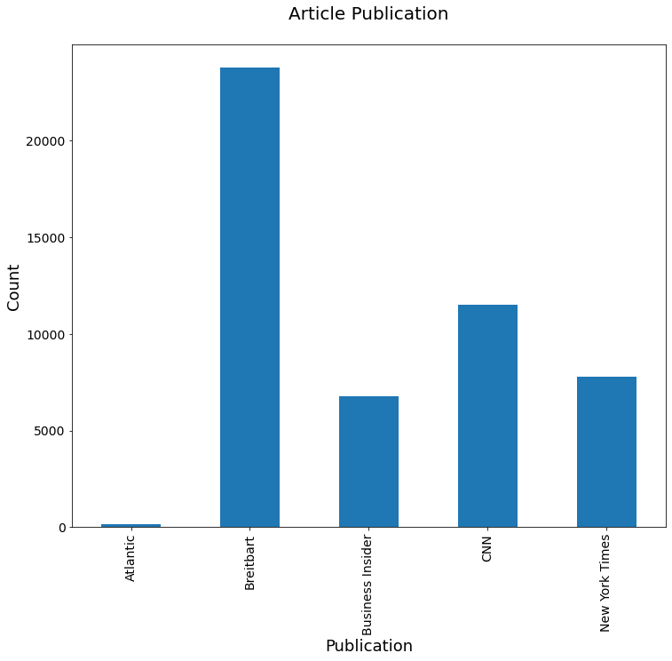
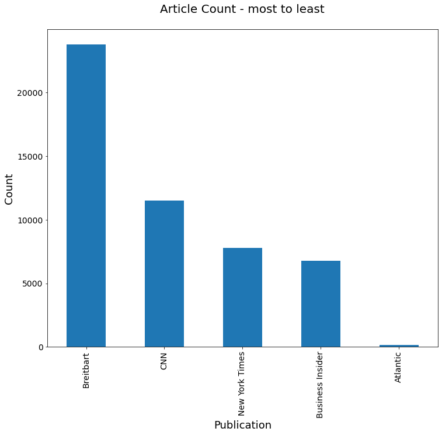
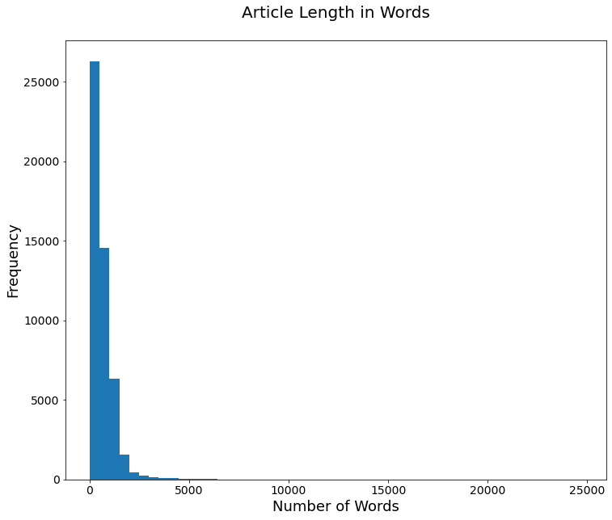

```python
#Case Study:  Testing  Hypothesis

#Hypothesis:  Articles about Climate Change are more likely to be published by "Liberal" sources

import pandas as pd
import numpy as np
import string
import re
import matplotlib.pyplot as plt
from collections import Counter
```


```python
#Step 1:  Load data into a dataframe
addr1 = "data/articles1.csv"
articles = pd.read_csv(addr1)
```


```python
#Step 2:  check the dimension of the table/look at the data
print("The dimension of the table is: ", articles.shape)
```

    The dimension of the table is:  (50000, 10)
    


```python
#Display the 1st five rows of data
print(articles.head(5))
```

       Unnamed: 0     id                                              title  \
    0           0  17283  House Republicans Fret About Winning Their Hea...   
    1           1  17284  Rift Between Officers and Residents as Killing...   
    2           2  17285  Tyrus Wong, ‘Bambi’ Artist Thwarted by Racial ...   
    3           3  17286  Among Deaths in 2016, a Heavy Toll in Pop Musi...   
    4           4  17287  Kim Jong-un Says North Korea Is Preparing to T...   
    
          publication                         author        date    year  month  \
    0  New York Times                     Carl Hulse  2016-12-31  2016.0   12.0   
    1  New York Times  Benjamin Mueller and Al Baker  2017-06-19  2017.0    6.0   
    2  New York Times                   Margalit Fox  2017-01-06  2017.0    1.0   
    3  New York Times               William McDonald  2017-04-10  2017.0    4.0   
    4  New York Times                  Choe Sang-Hun  2017-01-02  2017.0    1.0   
    
       url                                            content  
    0  NaN  WASHINGTON  —   Congressional Republicans have...  
    1  NaN  After the bullet shells get counted, the blood...  
    2  NaN  When Walt Disney’s “Bambi” opened in 1942, cri...  
    3  NaN  Death may be the great equalizer, but it isn’t...  
    4  NaN  SEOUL, South Korea  —   North Korea’s leader, ...  
    


```python
#what type of variables are in the table
print("Describe Data")
print(articles.describe())
# This shows the statistics applied only to numeric features of the dataset.
```

    Describe Data
             Unnamed: 0            id          year         month  url
    count  50000.000000  50000.000000  50000.000000  50000.000000  0.0
    mean   25694.378380  44432.454800   2016.273700      5.508940  NaN
    std    15350.143677  15773.615179      0.634694      3.333062  NaN
    min        0.000000  17283.000000   2011.000000      1.000000  NaN
    25%    12500.750000  31236.750000   2016.000000      3.000000  NaN
    50%    25004.500000  43757.500000   2016.000000      5.000000  NaN
    75%    38630.250000  57479.250000   2017.000000      8.000000  NaN
    max    53291.000000  73469.000000   2017.000000     12.000000  NaN
    


```python
print("Summarized Data on features of object type ")
print(articles.describe(include=np.object))
```

    Summarized Data on features of object type 
                                                        title publication  \
    count                                               50000       50000   
    unique                                              49920           5   
    top     The 10 most important things in the world righ...   Breitbart   
    freq                                                    7       23781   
    
                    author        date        content  
    count            43694       50000          50000  
    unique            3603         983          49888  
    top     Breitbart News  2016-08-22  advertisement  
    freq              1559         221             42  
    


```python
#display length of data or number of rows
print(len(articles))
```

    50000
    


```python
#display publishers (publications)
print(articles.publication.unique())

```

    ['New York Times' 'Breitbart' 'CNN' 'Business Insider' 'Atlantic']
    


```python
#display min, max of years published
print(articles['year'].min())
print(articles['year'].max())
print("\n")
#display how many articles from each year
print(articles['year'].value_counts())
```

    2011.0
    2017.0
    
    
    2016.0    28451
    2017.0    17908
    2015.0     3326
    2013.0      212
    2014.0       76
    2012.0       26
    2011.0        1
    Name: year, dtype: int64
    


```python
#Step 3:  Create some bar charts to show articles
#display bar chart of articles sorted by Publication Name
ax = articles['publication'].value_counts().sort_index().plot(kind='bar', fontsize=14, figsize=(12,10))
ax.set_title('Article Publication\n', fontsize=20)
ax.set_xlabel('Publication', fontsize=18)
ax.set_ylabel('Count', fontsize=18);
plt.show()
```





```python
#display bar chart of articles sorted by counts
ax = articles['publication'].value_counts().plot(kind='bar', fontsize=14, figsize=(12,10))
ax.set_title('Article Count - most to least\n', fontsize=20)
ax.set_xlabel('Publication', fontsize=18)
ax.set_ylabel('Count', fontsize=18);
plt.show()
```





```python
#Step 4:  clean text:  no punctuation/all lowercase
def clean_text(article):
    clean1 = re.sub(r'['+string.punctuation + '’—”'+']', "", article.lower())
    return re.sub(r'\W+', ' ', clean1)
```


```python
articles['tokenized'] = articles['content'].map(lambda x: clean_text(x))
print("clean text:  ",articles['tokenized'].head())

```

    clean text:   0    washington congressional republicans have a ne...
    1    after the bullet shells get counted the blood ...
    2    when walt disneys bambi opened in 1942 critics...
    3    death may be the great equalizer but it isnt n...
    4    seoul south korea north koreas leader kim said...
    Name: tokenized, dtype: object
    


```python
#look at mean, min, max article lengths
articles['num_wds'] = articles['tokenized'].apply(lambda x: len(x.split()))
print("Mean:  ",articles['num_wds'].mean())
print("Min:  ",articles['num_wds'].min())
print("Max:  ",articles['num_wds'].max())

```

    Mean:   636.26046
    Min:   0
    Max:   24736
    


```python
#Step 5:  remove articles with no words
len(articles[articles['num_wds']==0])
articles = articles[articles['num_wds']>0]
print("new mean:  ",articles['num_wds'].mean())
print("new min:  ",articles['num_wds'].min())

```

    new mean:   637.0886752778612
    new min:   1
    


```python
#Step 6:  Check for Outliers:  show bar graph of outliers
ax=articles['num_wds'].plot(kind='hist', bins=50, fontsize=14, figsize=(12,10))
ax.set_title('Article Length in Words\n', fontsize=20)
ax.set_ylabel('Frequency', fontsize=18)
ax.set_xlabel('Number of Words', fontsize=18);
plt.show()


```





```python
#Step 6:  Check for Outliers:  show bar graph of outliers
ax=articles['num_wds'].plot(kind='hist', bins=50, fontsize=14, figsize=(12,10))
ax.set_title('Article Length in Words\n', fontsize=20)
ax.set_ylabel('Frequency', fontsize=18)
ax.set_xlabel('Number of Words', fontsize=18);
plt.show()


```


```python

```
